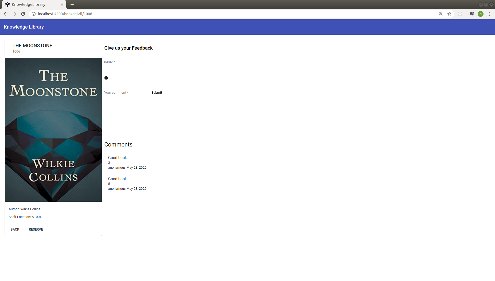

# KnowledgeLibrary

A single page Angular application to see the available books in a library and to reserve the book.

## JSON server

https://github.com/neethu-ms/knowledge-library-json-server

## Development server

Run `ng serve` for a dev server. Navigate to `http://localhost:4200/`. The app will automatically reload if you change any of the source files.

## Screenshots

---

---

## Dependencies

1. Angular CLI (version 9.1.0)
